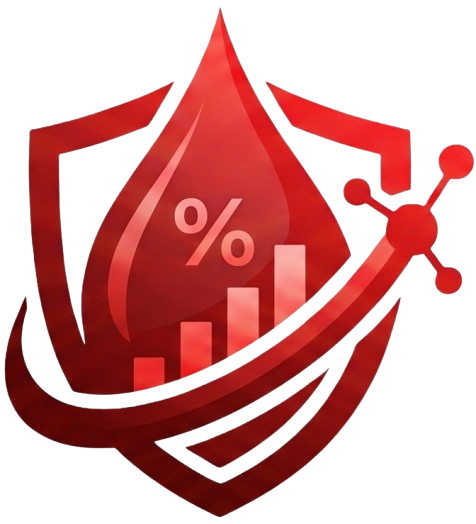

<div align="center">
        
</div>

# ***<span style="color:white;">AQUOS</span>***
#### Otimização da avaliação e monitoramento da taxa de sudorese para atletas e nutricionistas.  

## **<span style="color:white;">Integrantes</span>**

| Alunos                       | R.A        | Github           |Cargo          |
|------------------------------|------------|------------------|---------------|
| Beatriz de Siqueira Ferreira | 25.01241-0 | @biasiq          | Desenvolvedor |
| Guilherme Araújo             | 25.00615-6 | @Guilherme-p2006 | Desenvolvedor |
| Larissa Gomes                | 25.00625-5 | @gLariii         | Desenvolvedor |
| Luana Ferreira Silva         | 25.01656-9 | @luafxrreira     | Desenvolvedor |
| Thiago Santos Machado        | 25.01702-1 | @Thiago-stosm    | Desenvolvedor |

## **<span style="color:white;">Estrutura do projeto</span>**
```
AQUOS/
├── 📁 backend/                
│   ├── 📁 sql/                 # Modelagem e scripts do Banco de Dados
│   │   ├── 📄 database_documentation.pdf
│   │   ├── 📄 er_diagram_mvp.html
│   │   └── 📄 script.sql
│   ├── 📁 src/
│   │   ├── 📁 config/          # Configurações do sistema e banco
│   │   │   ├── 📄 config.py
│   │   │   ├── 📄 connection.py
│   │   │   └── 📄 database.py
│   │   ├── 📁 controllers/     # Lógica de rotas (endpoints)
│   │   │   ├── 📄 admin_controller.py
│   │   │   ├── 📄 athlete_controller.py
│   │   │   ├── 📄 external_controller.py
│   │   │   ├── 📄 report_controller.py
│   │   │   ├── 📄 session_controller.py
│   │   │   └── 📄 user_controller.py
│   │   ├── 📁 DAOS/            # Camada de persistência/acesso ao banco (Data Access Objects)
│   │   │   ├── 📄 admin_DAO.py
│   │   │   ├── 📄 athlete_DAO.py
│   │   │   ├── 📄 report_DAO.py
│   │   │   ├── 📄 session_DAO.py
│   │   │   └── 📄 user_DAO.py
│   │   ├── 📁 middlewares/     # Interceptadores (validação de token JWT)
│   │   │   └── 📄 auth.py
│   │   ├── 📁 services/        # Regras de negócio e cálculos estatísticos
│   │   │   ├── 📄 admin_service.py
│   │   │   ├── 📄 athlete_service.py
│   │   │   ├── 📄 external_service.py
│   │   │   ├── 📄 report_service.py
│   │   │   ├── 📄 session_service.py
│   │   │   └── 📄 user_service.py
│   │   └── 📁 utils/           # Funções auxiliares e scripts utilitários
│   │       ├── 📄 __init__.py
│   │       ├── 📄 logger.py
│   │       └── 📄 main.py
│   ├── 📁 tests/               # Testes automatizados
│   │   ├── 📁 DAOS/
│   │   ├── 📁 service/
│   │   └── 📁 utils/
│   └── 📄 requirements.txt     # Bibliotecas e dependências Python
├── 📁 frontend/                # Interface React (Vite + TypeScript + Capacitor)
│   ├── 📁 public/              # Ativos estáticos públicos e globais
│   │   ├── 📄 favicon.svg
│   │   ├── 📄 icons.svg
│   │   └── 📄 logo_aquos_sem_fundo.png
│   └── 📁 src/
│       ├── 📁 assets/          # Imagens locais e ícones dos componentes
│       │   ├── 📄 1L.svg
│       │   ├── 📄 250ml.svg
│       │   ├── 📄 500ml.svg
│       │   ├── 📄 bexiga1.svg
│       │   ├── 📄 bexiga2.svg
│       │   ├── 📄 bexiga3.svg
│       │   ├── 📄 hero.png
│       │   ├── 📄 react.svg
│       │   └── 📄 vite.svg
│       ├── 📁 components/      # Componentes visuais reutilizáveis
│       │   ├── 📄 Alert.tsx
│       │   ├── 📄 AlertStyles.css
│       │   ├── 📄 Logo.tsx
│       │   └── 📄 ProtectedRoute.tsx
│       ├── 📁 pages/           # Telas completas da aplicação
│       │   ├── 📄 Cadastro.tsx
│       │   ├── 📄 DadosAdm.tsx
│       │   ├── 📄 DadosAtleta.tsx
│       │   ├── 📄 DuranteSessao.tsx
│       │   ├── 📄 FiltroRelatorio.tsx
│       │   ├── 📄 Inicial.tsx
│       │   ├── 📄 Login.tsx
│       │   ├── 📄 MenuAdm.tsx
│       │   ├── 📄 MenuAtleta.tsx
│       │   ├── 📄 PosSessao.tsx
│       │   ├── 📄 PreSessao.tsx
│       │   ├── 📄 RelatorioAdm.tsx
│       │   ├── 📄 RelatorioAtleta.tsx
│       │   └── 📄 ResultadoSessao.tsx
│       ├── 📁 routes/          # Definição e controle de rotas
│       │   └── 📄 AppRoutes.tsx
│       ├── 📁 schemas/         # Validações de formulários e autenticação
│       │   └── 📄 authSchemas.tsx
│       ├── 📄 App.tsx          # Componente principal do frontend
│       ├── 📄 config.ts        # Variáveis de configuração da API
│       ├── 📄 main.tsx         # Ponto de entrada React
│       └── 📄 vite-env.d.ts
│   ├── 📄 index.html           # Página raiz HTML
│   ├── 📄 package.json         # Scripts e dependências Node.js
│   ├── 📄 tsconfig.app.json    # Configurações TypeScript da aplicação
│   ├── 📄 tsconfig.json        # Configurações globais do TypeScript
│   ├── 📄 tsconfig.node.json   # Configurações TypeScript para o ambiente Vite
│   └── 📄 vite.config.ts       # Configurações do bundler Vite
├── 📄 .env                    # Chaves privadas e segwhiteos (Ignorado no Git)
├── 📄 .env.example            # Modelo para configuração das variáveis locais
├── 📄 .gitignore              # Regras de exclusão do repositório Git
├── 📄 capacitor.config.ts     # Configurações de build mobile (Capacitor)
├── 📄 Makefile                # Automação de comandos para Linux/macOS
├── 📄 Makefile.win            # Automação de comandos para Windows
├── 📁 logs/                   # Histórico de registros gerados pelo backend
└── 📄 README.md               # Documentação principal do projeto
```

## **<span style="color:white;">Funcionalidades</span>**  

**ATLETA**
- Registro de sessões de treino com dados pré, durante e pós-sessão 
- Monitoramento de ingestão de fluidos durante o treino  
- Cálculo automático de taxa de sudorese, balanço hídrico e variação de massa corporal  
- Alertas de risco de desidratação e hiper-hidratação  
- Painel analítico pessoal com gráficos de evolução  
- Exportação de relatório PDF individual  
- Registro automático de temperatura e umidade via API climática

**ADMINISTRADOR**
- Painel analítico com filtros por modalidade, equipe e atleta  
- Visualização agrupada por condição climática  
- Monitoramento de atletas em risco em tempo real  
- Exportação de relatório PDF agregado    

## **<span style="color:white;">Tecnologias utilizadas</span>**

**FRONTEND**  
- React  
- TypeScript  
- Vite

**BACKEND**  
- Python   
- Flask  
- JWT 

**BANCO DE DADOS**  
- PostgreSQL

**PDF**   
- ReportLab

**OpenWeatherApi**   
- Dados climáticos em tempo real

## **<span style="color:white;">Pré-requisitos</span>**

- Python 3.11+  
- PostgreSQL 18  
- npm

## **<span style="color:white;">Como executar no modo desenvolvimento</span>**

1. Clone o repositório e mude o diretório
```bash
git clone https://github.com/seu-usuario/aquos.git
cd aquos
```

2. Crie e ative o ambiente virtual
```bash
python -m venv venv
source venv/bin/activate      # Linux/macOS
venv\Scripts\activate         # Windows
```

3. Instale as dependências
```bash
pip install -r backend/requirements.txt
cd frontend
npm i
```

4. Retorne para raiz do projeto
```bash
cd ..
```

5. Execute o script de criação das tabelas:
```bash
psql -U seu_usuario -d seu_banco -f backend/sql/script.sql
```

6. Configure as variáveis de ambiente e edite o .env com suas credenciais
```bash
cp .env.example .env
```

7. Execute o servidor
```bash
npm run dev
```
## **<span style="color:white;">Como executar no modo produção</span>**
1. Iniciar o Servidor Backend (Flask)
```bash
python -m backend.src.main
```
2. Instalar e Abrir o Aplicativo
```bash
# Navegue até o diretório de compilação final do instalador:
src-tauri/target/release/bundle/nsis/
# Execute o assistente de instalação aquos_0.1.0_x64-setup.exe no Windows.
# Abra o AQUOS a partir do atalho gerado automaticamente em sua Área de Trabalho.
```

## **<span style="color:white;">Licença</span>**  
Este projeto foi desenvolvido como parte do Projeto Integrador Interdisciplinar do Instituto Mauá de Tecnologia em parceria com a São Camilo.

## **<span style="color:white;">Contato</span>**
Para mais informações sobre o projeto, entre em contato com a equipe de desenvolvimento através dos perfis do GitHub listados acima.

*Desenvolvido com foco e dedicação pelos estudantes do IMT.*